## Example: Excel Data Robot Task

:::info Note

This Example serves as a guide to perform an Excel task. It is an exercise that can be replicated for practice in the user's own system.

The training machine for this course does NOT have Excel installed.

:::

## Purpose and Method

Use an OpCon RPA Robot Task to pull Excel Cell data from a workbook and transfer it to a new/different workbook

This is example utilizes two Excel Files:

* A **Source File** that contains the data to be transferred.

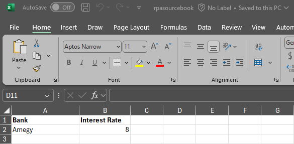

* A **Target File** to which the data will be transferred.

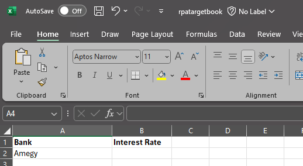

### Create the Variable

A **User Variable** must be created to store the data to be transferred.

In this case, we are transferring an interest rate value from the **Source File** to the **Target File**.

We can create the **User Variable** by creating a new Robot Task and clicking the **Variables** button in the bottom left-hand corner of the Tray Client.

#### Create the Excel Robot Task

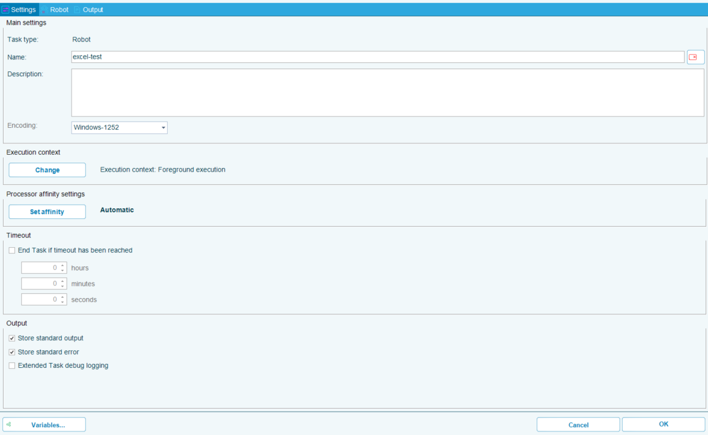

#### Add the User Variable

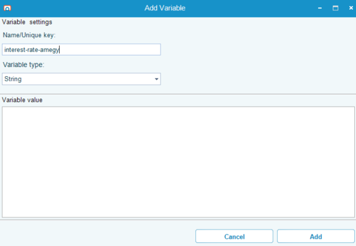

#### View the Variable Key and Preview in the Variable List

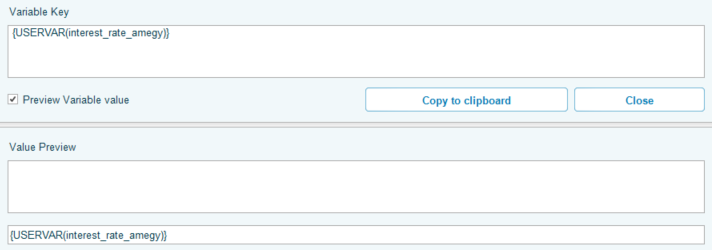

### Create the RPA Task to Read the Cell

In the **Robot Designer** tab we can drag and drop **Task Actions** to build the robot or we can utilize the **Record** tool. 

Below are the steps to build with the drag and drop method.

1. Select an Excel **Open Workbook** task from the left menu and drag it into the **Sequence** window.
2. In the **File name** box enter the path to your created workbook (**rpasourcebook**).

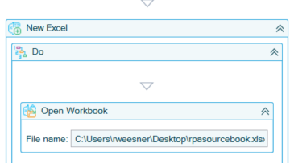

3. Select an **Excel Cell - Get Cell Value** task from the left menu and drag it into the **Sequence** window below the **Open Workbook** task.
4. Click the **Click to select Excel element** link in the task window.
5. With the source workbook and sheet in focus,click on the cell you wish to retrieve the value from.
6. Hold down the CTRL button and left-click at the same time.
7. Back in the Edit Task Screen - Verify the Cell Address.
8. Select or verify the **Variable type** as **User**.
9. Select or verify the **Variable** as **interest_rate_amegy**.

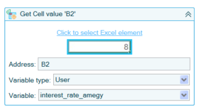

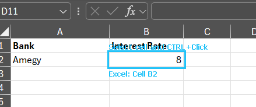

### Create the RPA Task to Set the Cell 

1. Select an Excel **Open Workbook** task from the left menu and drag it into the **Sequence** window below the **Get Cell Value** task.
2. In the **File name** box enter the path to your created workbook (**rpatargetbook**).

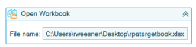

3. Select an **Excel Cell - Set Cell Value** task from the left menu and drag it into the **Sequence** window below the **Open Workbook** task.

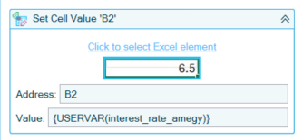

4. Click the **Click to select Excel element** link in the task window.
5. With the target workbook and sheet in focus, click on the cell you wish to set cell value on.
6. Hold down the CTRL button and left-click at the same time.

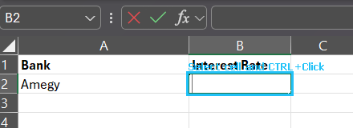

7. Back in the Edit Task Screen - Verify the Cell address.
8. Select or verify the **Value** as the **User Variable** `{USERVAR(interest_rate_amegy)}`.

### Save the Excel File

1. Select an Excel Workbook **Save Workbook** task from the left menu and drag it into the **Sequence** window below the **Set Cell Value** task.
2. Click the **Click to select Excel element** link in the task window.
3. Verify the Workbook name to save is correct.

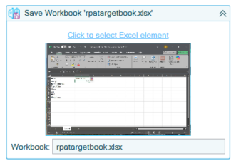

### Test the Robot

1. Click **Test Run** in the bottom right hand corner of the Robot **Edit Task** screen.
2. The Robot will run the sequence.
3. Verify that the sequence has completed successfully by checking that the interest rate variable has been set in **rpatargetbook** cell **B2** and that it matches the value in **rpasourcebook** cell **B2**.

### Save the Robot

1. Click **OK** in the bottom right hand corner of the Robot **Edit Task** screen.
2. Choose from **Save and Publish** or **Save as Draft**. In this case, choose **Save and Publish**.
3. Click **OK** to acknowledge that the Robot has been saved and published.
