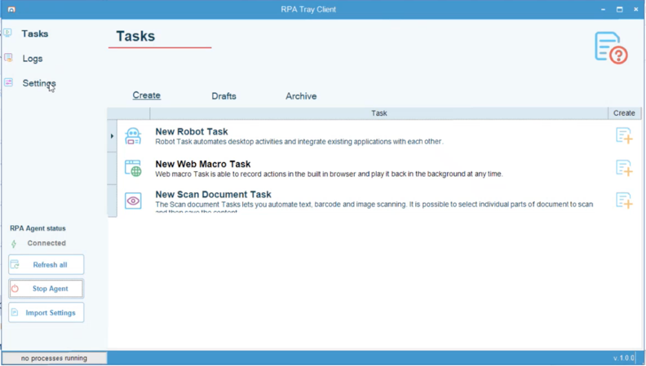
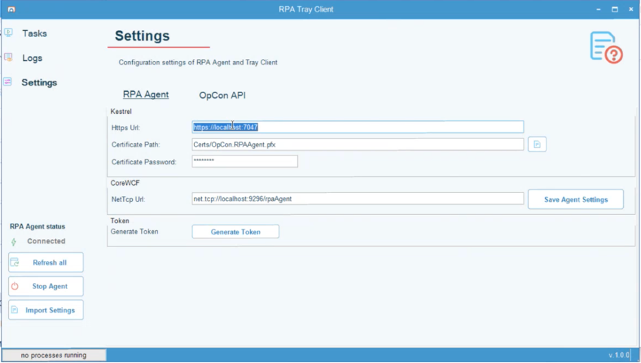
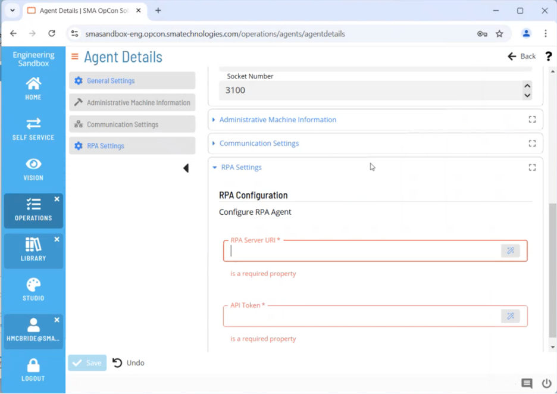
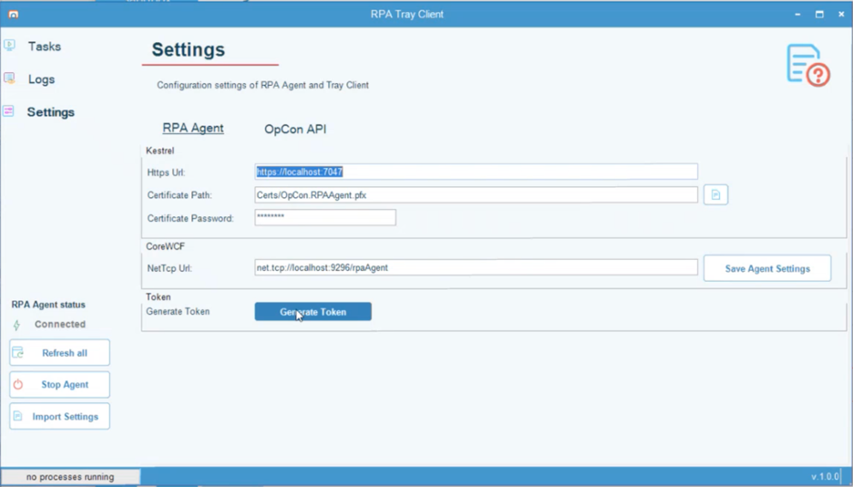
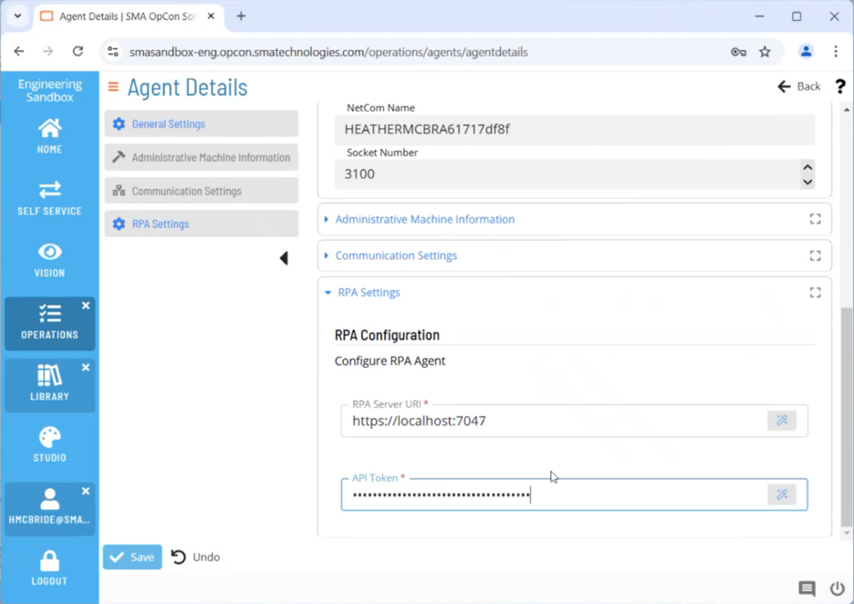
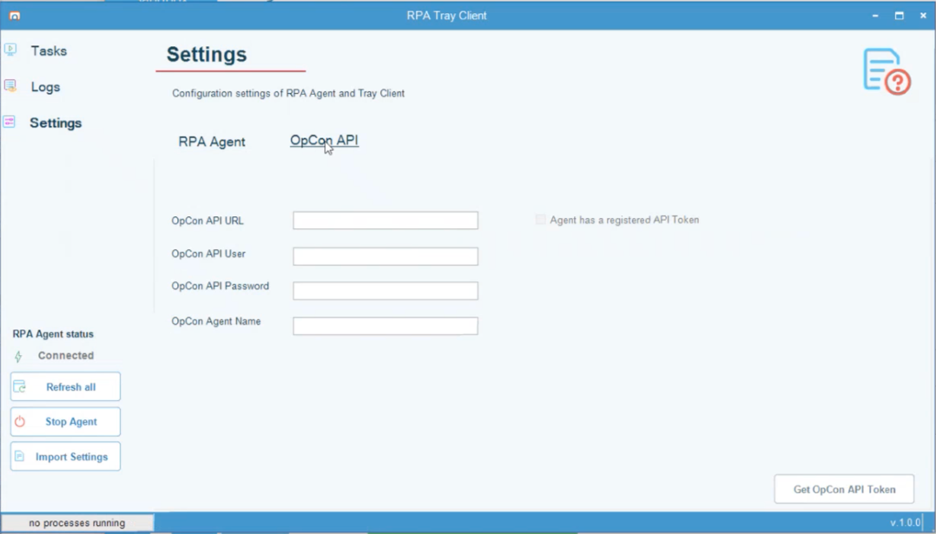

# Installation - OpCon RPA

### Install OpCon RPA for Cloud
The RPA Agent and Netcom Relay will need to be installed on the windows system that will be responsible for hosting the server and/or client and executing the RPA workflow.

You should have 3 items ready for before you get started with the RPA cloud setup. 

1.	The NetCom Relay installer, <ins>SMANetcomRelay.exe</ins>.  The NetCom Relay installer is not needed if you are not integrating RPA with a cloud instance of OpCon CORE Automate/Solution Manager.
  1.	On your Windows Computer open the command prompt and choose “Run as Administrator”.
  2.	When prompted if you’d like to allow this app to make changes to your device, choose “Yes”.
2.	The ACS Plugin DLL named <ins>sma.acs.OpConRPA.dll</ins>.
3.	The RPA Agent installer named <ins>RPAAgent.1.0.0</ins>.

#### Solution Manager Setup
1.	Log into Solution Manager
2.	Navigate to the Access Management screen
  1.	On the USER tab select the user who will be configuring the RPA connection.
  2.	In the context of the selected user click the SETTINGS tab.
  3.	Ensure the selected user has “Enable external tokens” checked.
  4.	If this option was not checked and the user is currently signed in, this user will need to sign back in before this change will take affect.
3.	Navigate to your user profile page.
 1.	On this page within the ACCOUNT tab ensure that you have a password set.
 2.	Make sure you remember this password, you’ll need it later.
 3.	Click to save.
 4.	Navigate to the EXTERNAL TOKEN tab.
 5.	Leave the API Token option selected and click “Generate”.
 6.	Copy this token to your clipboard AND save it in a safe place, you will need it later. It will be used for the Relay set up
 7.	Click OK to dismiss the window.
 8. For instructions on how to set up Relay, [click here](https://help.smatechnologies.com/opcon-relay#install)

#### RPA Agent and Relay Connection setup
1.	In your Windows File Explorer Navigate to C:\Programdata.   
2.	Drill down into the OpConxps directory until you reach the Plugins directory.
3.	Open the Plugins directory, this is where you’re going to put the RPA Plugin DLL file. For On-Prem users this should be C:\ProgramData\OpConxps\SAM\plugins.
 1.	Navigate to where you have the The ACS Plugin DLL.  It is called sma.acs.OpConRPA.dll. 
 2.	Move this .dll file into the plugins directory shown in step 2 of this section.

#### Testing what you’ve set up so far:
1.	Opening Solution Manager.
2.	Navigate to the Library > Agents.
3.	Click Add to add a new Agent.
 1.	Give your agent a name, remember this name, you’ll need it later. 
 2.	Select RPA from the type drop down above General Settings.
 3.	Open the RPA Settings section at the bottom of the page.
  1.	Leave this open, you’ll come back to it shortly.

#### FINALLY the RPA Installer
1.	Double click on the RPA Agent Installer.  It is named RPAAgent1.0.0 (though the version number might differ)
2.	When prompted if you’d like to allow this app to make changes to your device, choose “Yes”.
3.	When the installation is complete you will see the RPA user interface pop up on your screen.
4.	On the left side of the RPA interface click “Settings”.
 
5.	When on the “Settings” screen make sure you’re on the RPA Agent tab and copy the value out of the Https URI field.
 
6.	Paste that URI value into the RPA Server URI in Solution Manager.
 
7.	Back in the RPA interface, click generate token.  Note, that this automatically copies the token to your clipboard.
 
8.	Paste that token in the API Token field within Solution Manager.
 
9.	Click to save your Solution Manager changes
10.	In the RPA “Settings” interface click on the OpCon API tab.
 
11.	In the OpCon API URL field enter the same fully qualified domain name that you set in the Solution Manager Setup step 9. For On-Prem this is likely the base domain of your Solution Manager instance.
12.	In the OpCon API User field enter the username you’re logged in with your instance of Solution Manager.
13.	In the OpCon API Password field enter the password you set in step 3.2 of the Solution Manager Setup section.
14.	In the OpCon Agent Name field enter the name of the Agent you just created in step 3.1 of the Testing What You’ve Setup So Far.
15.	Click Get OpCon API Token in the lower right corner of the RPA interface.
16.	You should receive a success message at this point!!! Congratulations you’re ready to go!!!