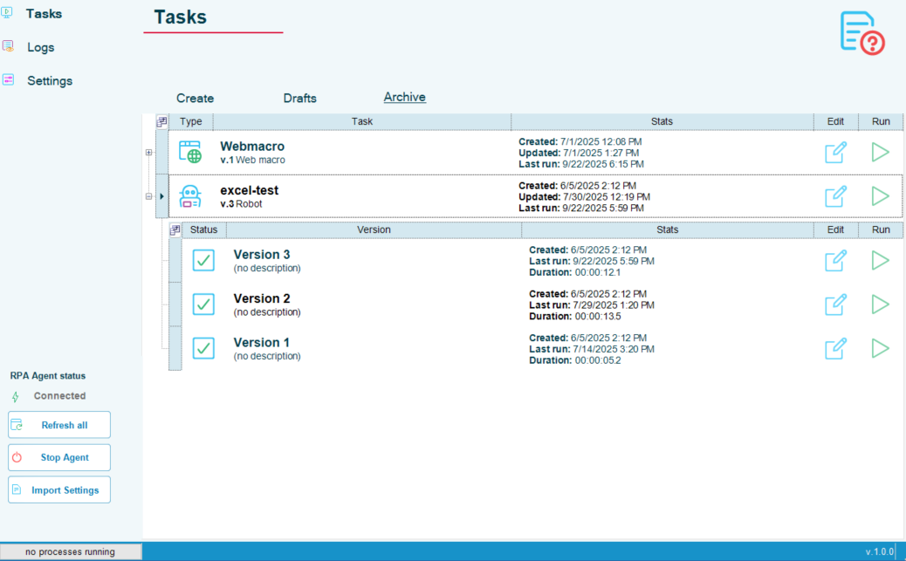
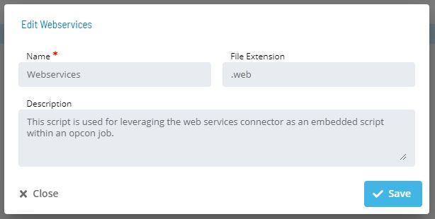
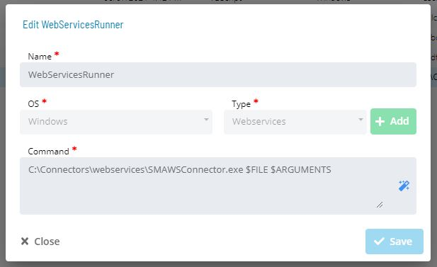
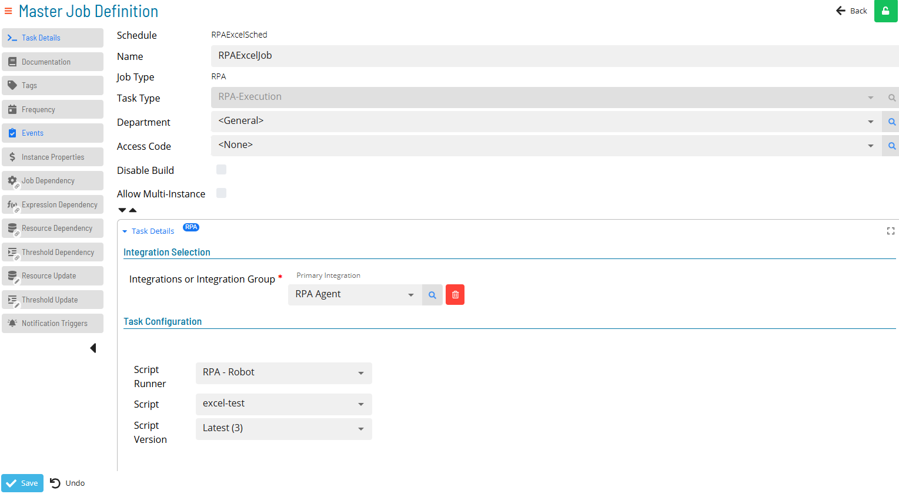

## OpCon RPA Job Orchestration

OpCon RPA Robot Tasks can be orchestrated with OpCon to run unattended through configuration of an OpCon Schedule and Job or attended with the use of an OpCon Self Service button.

RPA Robots are imported into OpCon by creating a *Webservices* **Script Type** and importing Robots from the RPA Tray Client into OpCon as executable scripts.

### Configure OpCon RPA Agent (In OpCon Solution Manager)

* In OpCon, be sure that your RPA Agent is created and configured.
* Confirm the Agent is connected and can trigger published Robots.

### Build your Robots (In RPA Client)

* Build and save your Robots in **Drafts**.
* **Publish** the Robot tasks to push them into OpCon's **Script Repository**.
    * Once your Robots are published, they are moved to the RPA Tray Client's **Archive**.

### Set Up Script and Job (In OpCon Solution Manager)

In Scripts:

* Create a new **Script Type**: `.web`.

* Create a new **Script Runner**: `Windows OS`.

* Create a new Schedule in Solution Manager Studio
* Add an **RPA Job Type** with **Embedded Script**.
* Select **RPA Agent** as the **Primary Integration**.
* Assign the **Script Runner** and **Script**.
* Set necessary Environmental Variables.

* Save the Job
    * Set a Frequency and other Triggers and Conditions for the Job if desired

:::info Note

Remember that RPA Robot tasks can be run **Attended** or **Unattended**

:::