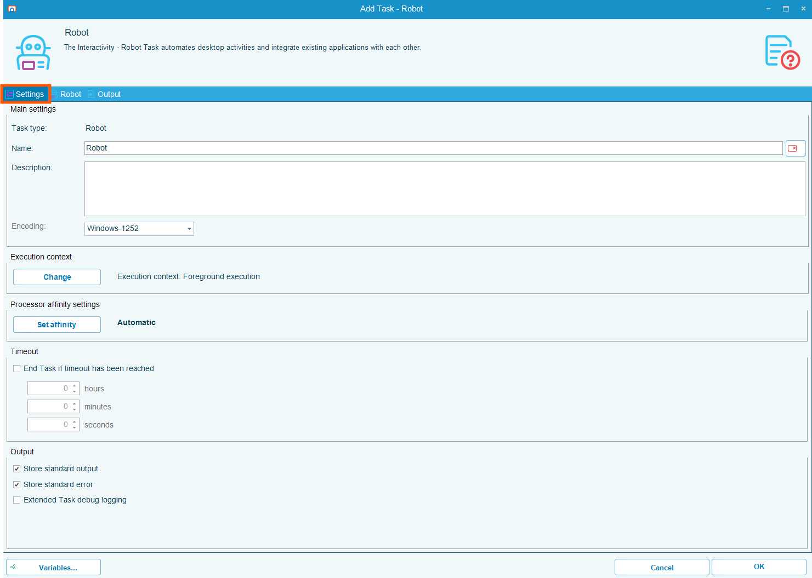
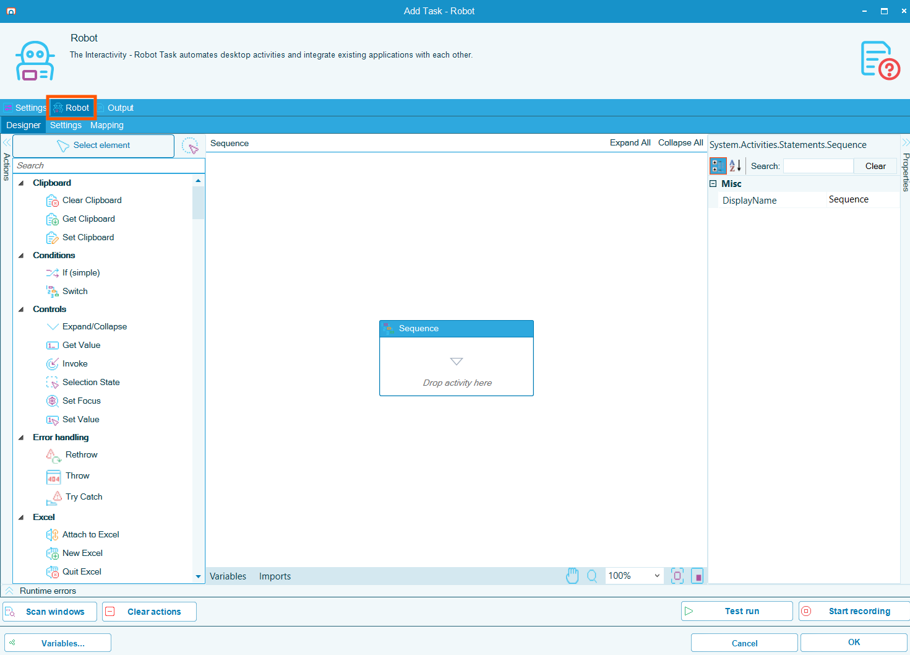
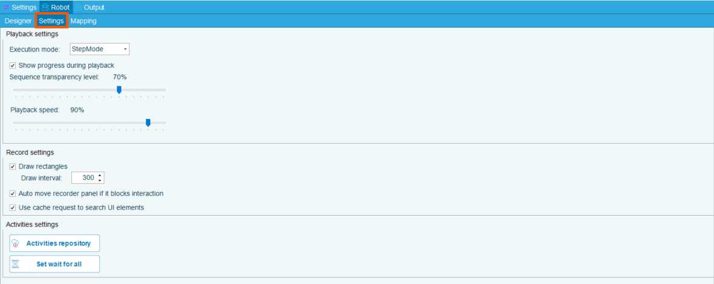
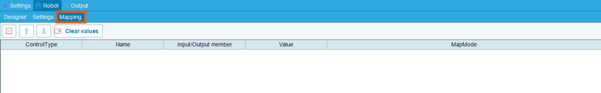
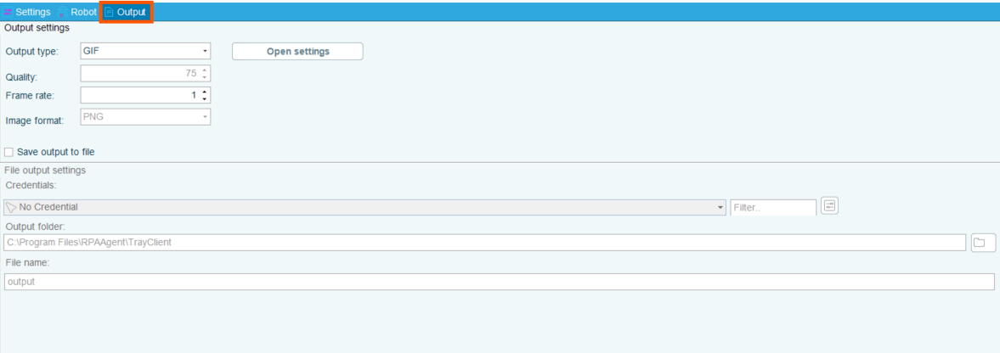

## Robot Tasks

**Robot** tasks allow users to automate repetitive manual tasks such as keystrokes, mouse clicks, data entry, and web interactions through screen recording. These recordings can then be replayed to automate the desired process. 

This process can be further automated by orchestrating the RPA task to run through an OpCon workflow.

### Robot Task General Settings Screen

The General Settings screen offers options for:

* Encoding
* Execution Context
* Processor Affinity Settings
* Timeout
* Output storage and debugging

### Robot Task Designer Screen

### Robot Task Settings Screen

The Settings Screen allows for: 

* Configuration of Playback Settings including execution mode, transparency, and playback speed
* Configuration of Record Settings
* Configuration of Activities Settings

### Robot Task Mapping Screen

The Task Mapping Screen allows configuration of how variables and data inputs are passed into and out of a robot task. 

The Screen allows:

* Bind variables from OpCon to specific fields or actions within the robot
* Specify input parameters that the robot will use during execution such as file paths, user credentials, form values
* Capture output values from the robot task and pass them back to OpCon for downstream processing or decision-making

### Robot Task Output Screen

The Output screen allows for configuration of output type, quality, and location.

