## Scan Document Tasks

Scan Document tasks are automated workflows that use **OCR** (Optical Character Recognition) to extract data from scanned documents such as:

* PDFS
* Images
* Printed Forms

The Scan Document task helps users to integrate data into other business processes by:

* Digitizing paper-based inputs
* Extracting structure or semi-structured data
* Feeding extracted data into databases, reports, or other systems
* Triggering downstream automation based on document content

### Scan Document - Main Settings Screen

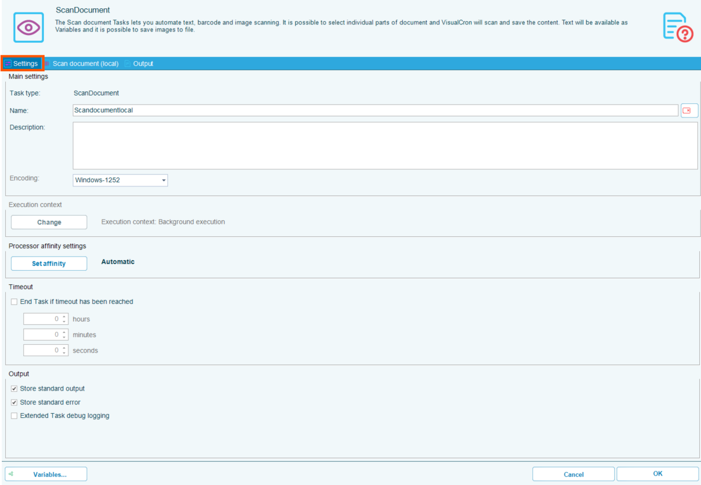

### Scan Document - Scan Properties Screen

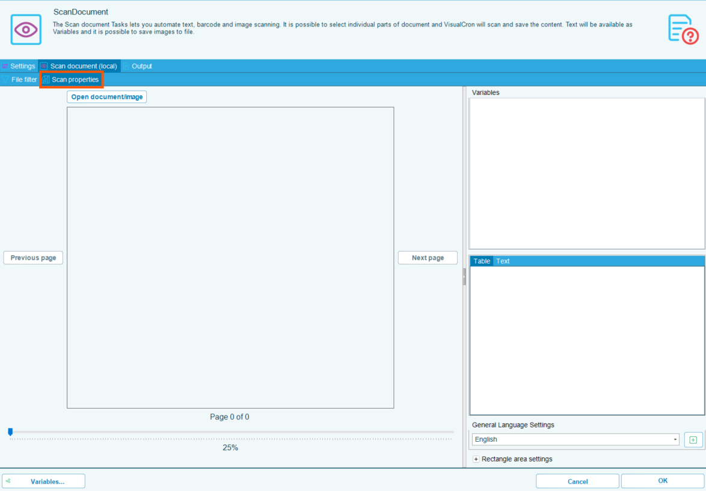

### Scan Document - File Filter Screen

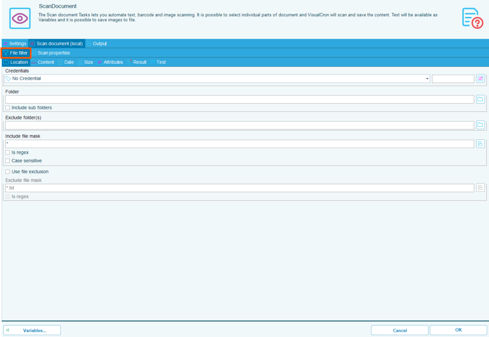

#### File Filter Subtabs

* **Location**

##### 

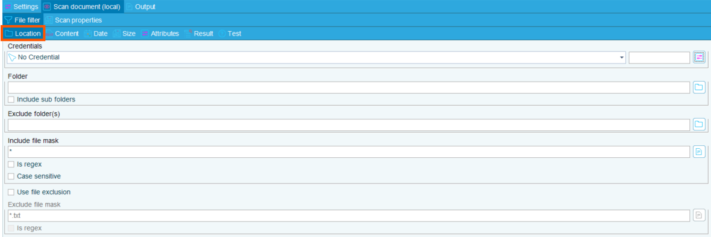

* **Content**

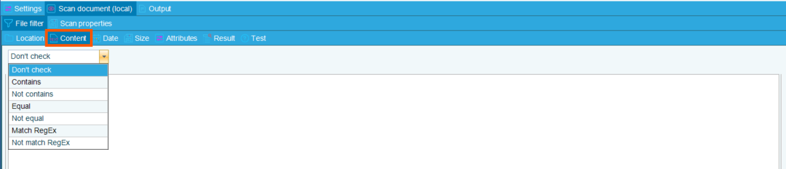

* **Date**

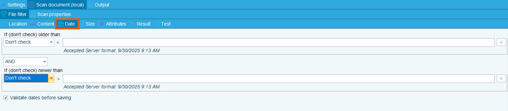

* **Size**

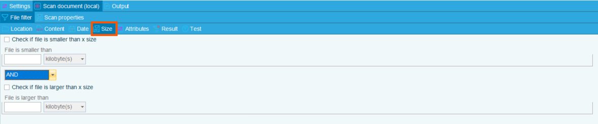

* **Attributes**

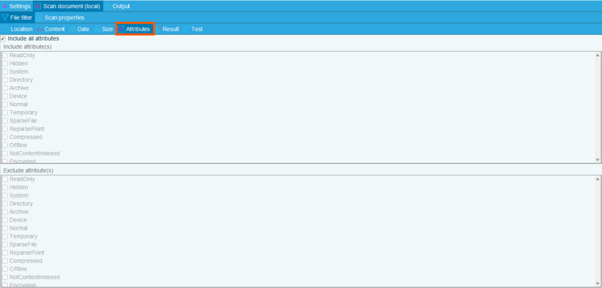

* **Result**

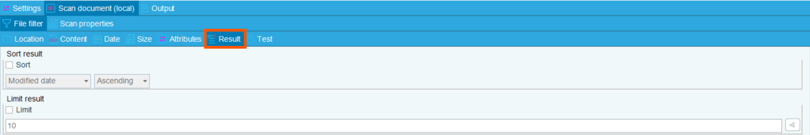

* **Test**

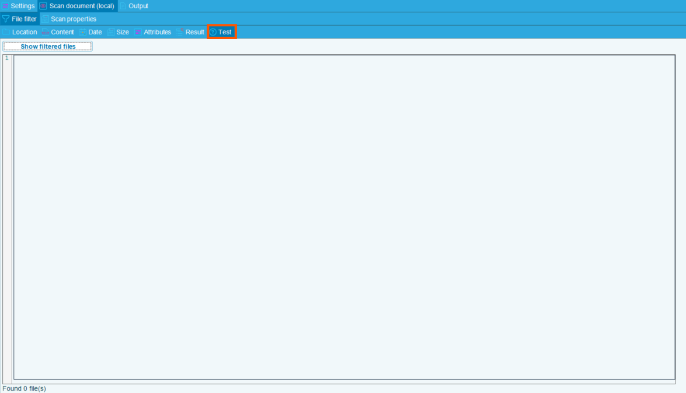

### Scan Document - Output Screen

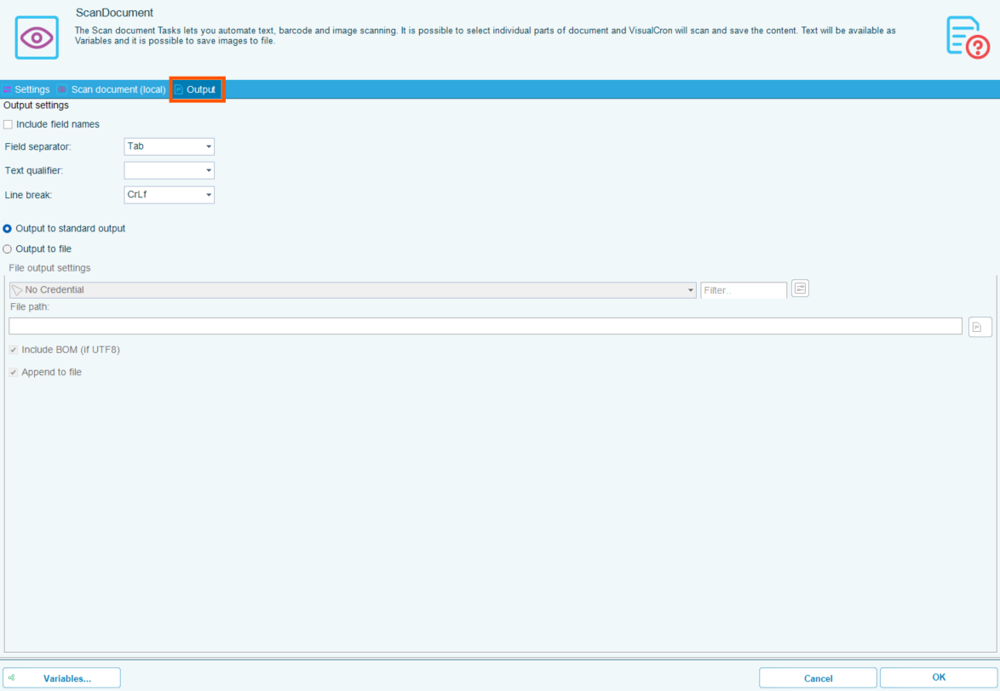