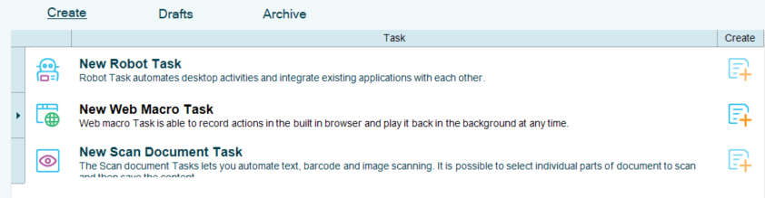
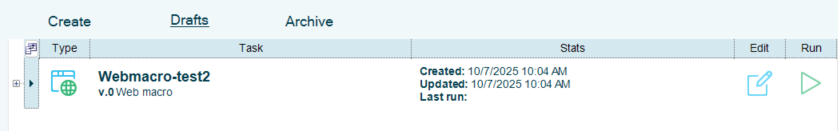
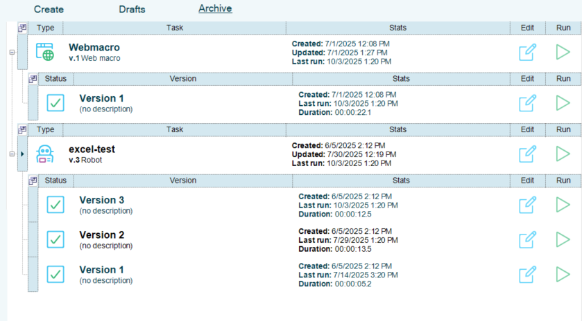

## Tasks Page

The **Create** tab allows users to select from the available Tasks.

The **Drafts** tab is where created Tasks will be saved and stored until published.

The **Archive** tab is where published tasks and their edited versions are held. From this page the tasks can be edited and run manually.

