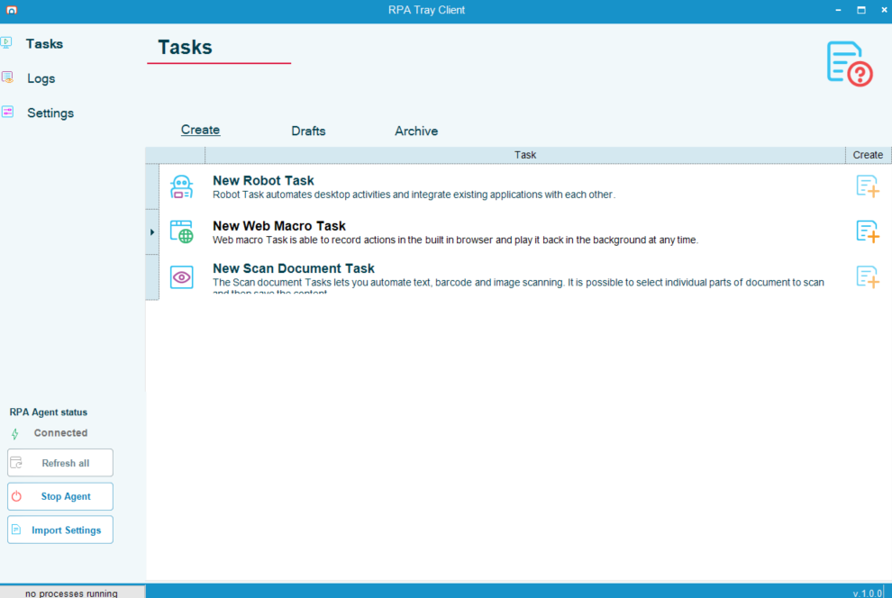
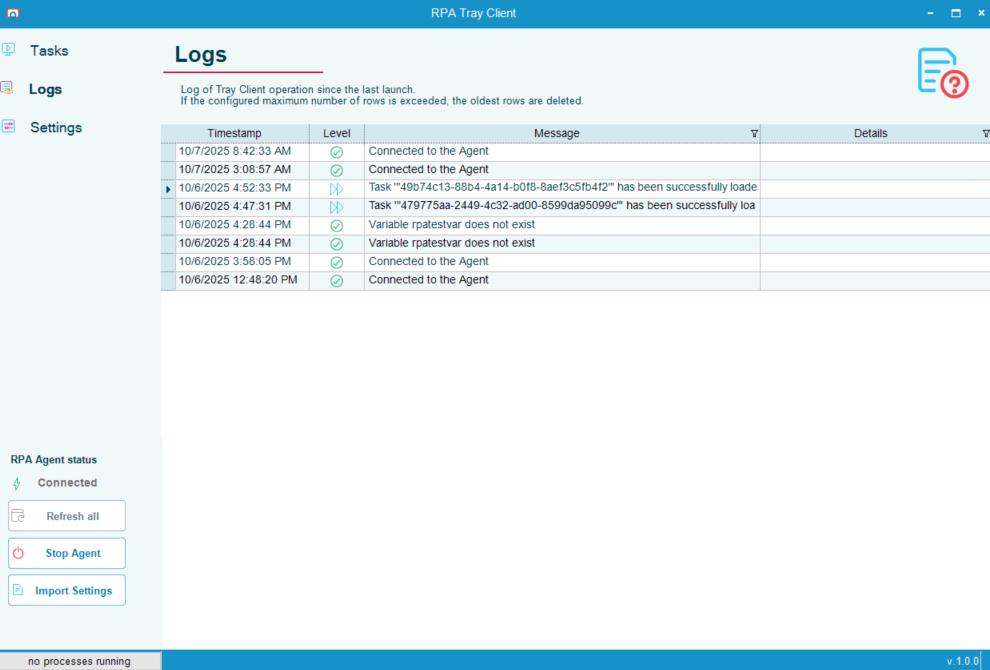
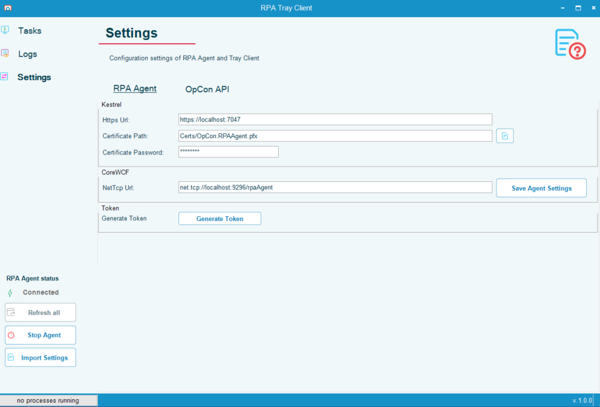

## Tray Client Overview

### Task Page

The Task Page contains the menu options to create the three types of Robot Tasks currently available in OpCon RPA.

Those are:

* Robot Task
* Web Macro Task
* Scan Document Task

### Log Page

The Log Page lists activities since the last launch of the RPA Tray Client.

### Settings Page

The Settings Page contains configuration settings for the RPA Agent and Tray Client.

