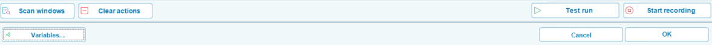
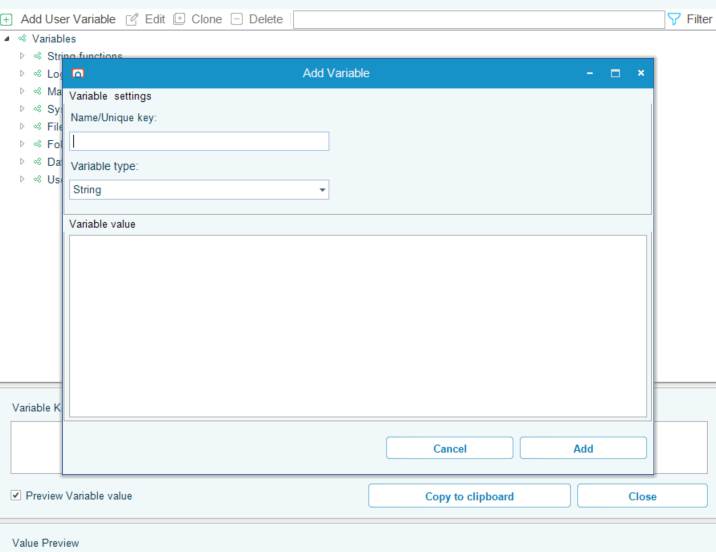
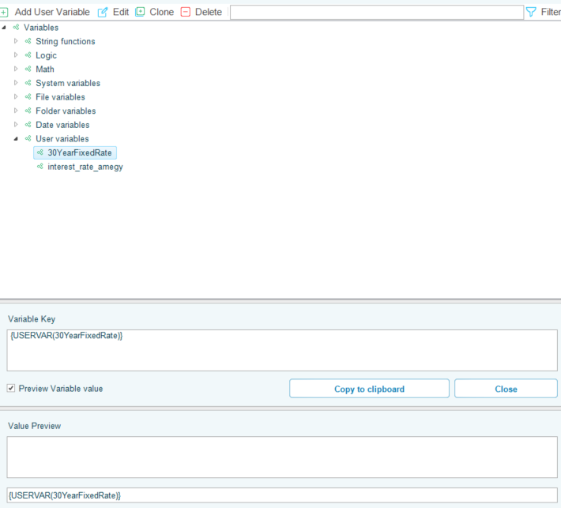

## Variables

Variables in OpCon RPA are dynamic placeholders that allow you to reuse and adapt data across tasks and jobs. Instead of hardcoding values like file paths, usernames, or passwords, you define them once as variables and reference them wherever needed. This approach improves maintainability, reduces errors, and simplifies updates.

:::warning Warning

Note that the syntax of an RPA variable and an OpCon variable differ significantly!

**OpCon RPA** variable syntax: `{VarType(VarName)}`
- Example: `{USERVAR(TestVar)}`

**OpCon** variable syntax: `[[VarName]]`
- Example: `[[TestVar]]`

:::

### Variable Types

* String Functions
* Logic
* Math
* System Variables
* File Variables
* Folder Variables
* Date Variables
* User Variables

### Using Variables

* Most fields in OpCon RPA support variables. If a field turns light blue when dragging a variable over it, it accepts variables.
* Use the Variables button in the status bar or the **Job > Main Settings > Job Variables** section.
* Use curly braces {} to insert variables, e.g., {USER(username)}.
* You can override job variables using the Job/Task Control Task.

### User Variable Example

* Add a User-defined Variable by clicking the **Variables** tab in the bottom of the task screen

* Click **Add** to Add a User-defined Variable
    * Name and configure the User-defined Variable

* In the Variable list screen, notice the context and syntax of the new User-defined Variable

