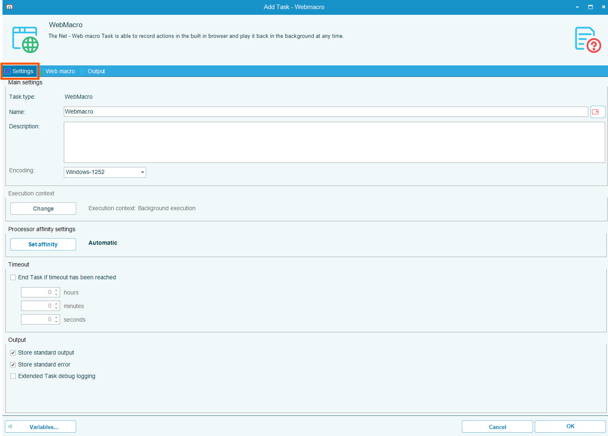
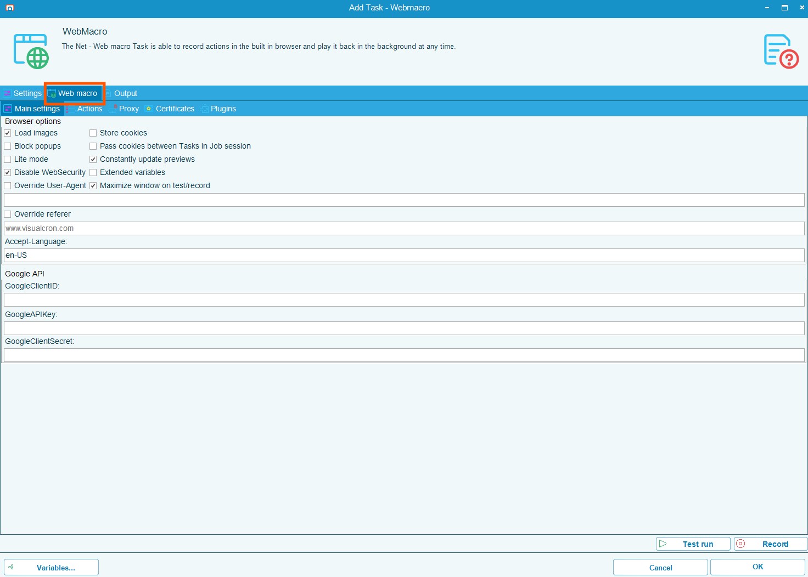
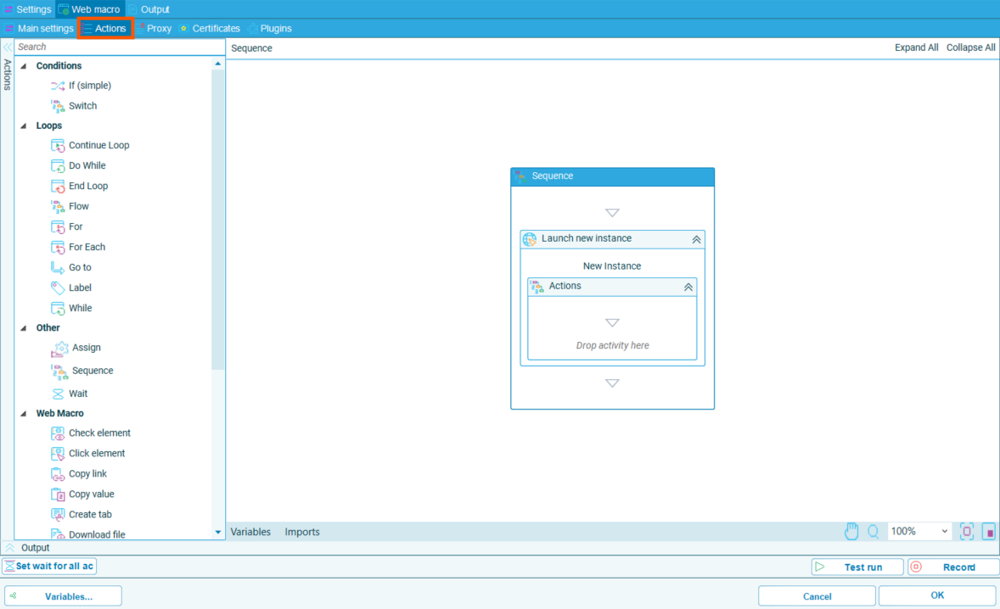
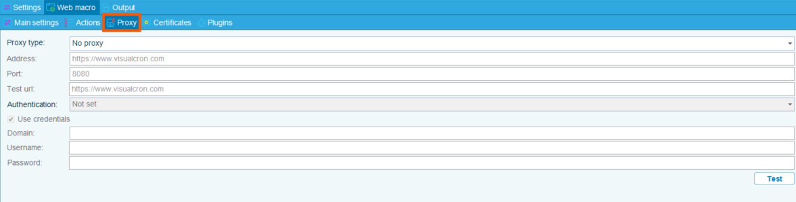
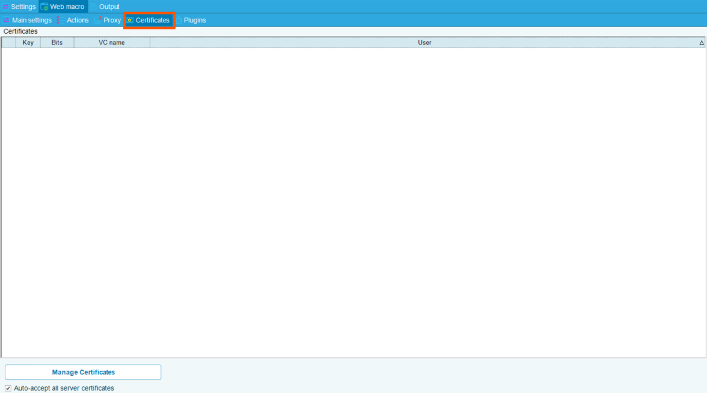
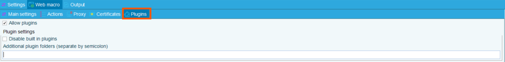
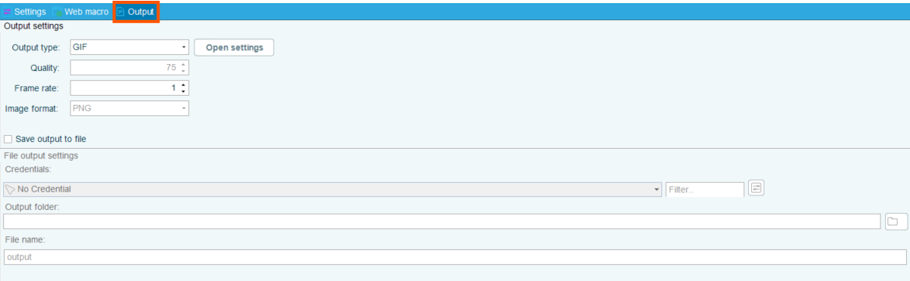

## Web Macro Tasks

**Web Macro** tasks are designed to automate manual web browser actions and workflows where repetitive actions are performed.

Some tasks that can be automated by Web Macro tasks include:

- Form submission
- Data extraction
- Navigating across web pages

This process can be further automated by orchestrating the RPA task to run through an OpCon workflow.

### Web Macro - General Settings Screen

The General Settings screen offers options for:

* Encoding
* Execution Context
* Processor Affinity Settings
* Timeout
* Output storage and debugging

### Web Macro - Main Settings Screen

The Web Macro Main Settings screen offers Browser interaction settings such as blocking popups, disabling web security, storing and passing cookies, and window size recording.

The screen also offers configuration for Google API connections.

### Web Macro - Actions Screen

The Web Macro Actions Screen is a central interface for designing and executing browser-based automation tasks. 

It allows users to record, edit, and run sequences of actions that mimic human interactions with websites. These actions are typically used to automate repetitive tasks such as logging in, scraping data, downloading files, and navigating web interfaces.

* **Record Mode**: Users can launch a recording session where every click, scroll, and input on a webpage is captured. A blue outline highlights selected elements, and the sequence of actions is logged in the right-hand panel.

* **Drag and Drop Mode**: Users can drag and drop desired actions from the left-hand panel into the sequence box in the right-hand panel.

### Web Macro - Proxy Screen

The Proxy Settings Screen allows selection and configuration of Proxy usage. 

### Web Macro - Certificates Screen

The Certificates Screen allows for management of system certificates.

### Web Macro - Plugins Screen

The Plugins screen allows for toggling, disabling, and managing plugins.

### Web Macro - Output Screen

The Output screen allows for configuration of output type, quality, and location.

